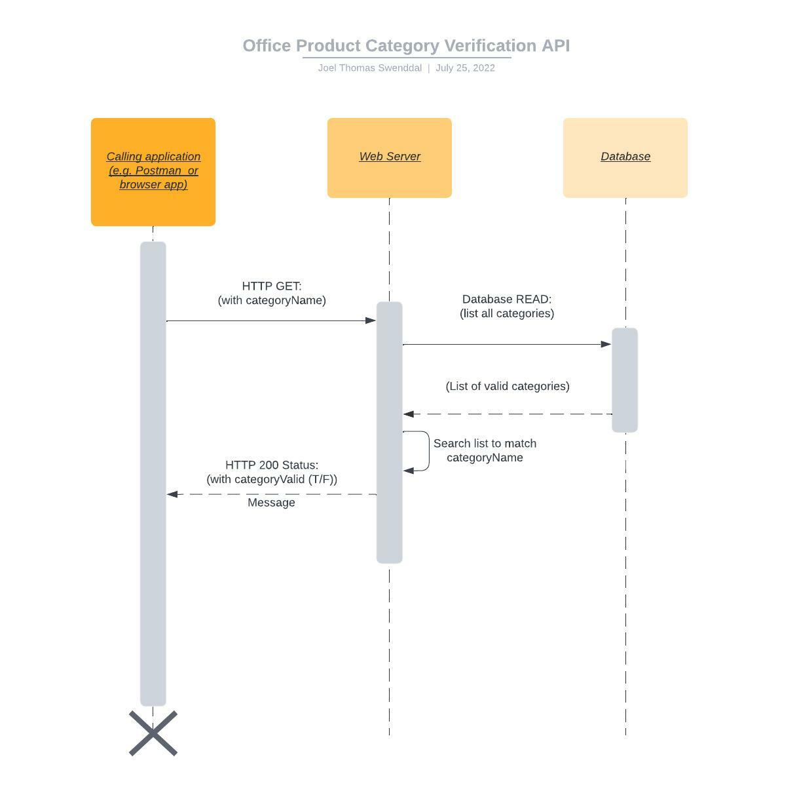

# Amazon Office Product Category Verification API

#### CS 361 - Summer 2022
#### Assignment 7 - Microservice Implementation
#### Joel Swenddal
---

## Overview
This API provides the ability to check whether a character string matches the name of an Amazon product category in root category the "Office Products" on Amazon's website. Requests are made via HTTP and responses are returned via HTTP in JSON format.

## Making requests - Category Verification
To verify whether a particular name exists as a searchable category within the larger Amazon category of "Office Products", make a HTTP GET request to the following URL:

`https://amaz-search-swenddaj-1018.uc.r.appspot.com/categories/search/ + [category name to search for]`

Note that the category name is NOT included as a query string. Also, note that Amazon's search categories do not use the word "and" -- instead the "&" symbol is used. Amazon's product category names often do include spaces, and these should be included in the URL string. Ommitting a space or using "and" instead of "&" are often reasons for a failed verification. Finally, note that the string "Office Products" itself is not a valid string for this API, since this is the root node under which all other names are reachable. This API only searches child nodes under the larger "Office Products" category.

### Example requests (both valid)
`https://amaz-search-swenddaj-1018.uc.r.appspot.com/categories/search/Desk Accessories & Workspace Organizers`

`https://amaz-search-swenddaj-1018.uc.r.appspot.com/categories/search/Notebooks & Writing Pads`

## Responses - Category Verification
Responses have a 200 status code whether or not the category name successfully matched a valid category name on Amazon. In the message body is a JSON object with the following key/value format:

    {
        "validCategory": bool,
        "categoryName": string, 
        "categoryNumber": string, 
        "url": string, 
        "path": string
    }

The `validCategory` bool value confirms whether the string in the Request was indeed a valid category name under the "Office Products" hierarchy. The `categoryName` value reports the category name string. The `categoryNumber` value reports Amazon's assigned id number for the category. `url` gives the url address of the category page on Amazon's product site, and the `path` value shows the path to the category under the "Office Products" origin node.

### Example response
Successful Request for: `https://amaz-search-swenddaj-1018.uc.r.appspot.com/categories/search/Desk Accessories & Workspace Organizers`

Response:

    {
        "validCategory": true,
        "categoryName": "Desk Accessories & Workspace Organizers",
        "categoryNumber": "1069514",
        "url": "https://www.amazon.com/s?node=1069514",
        "path": "Office Products > Office & School Supplies > Desk Accessories & Workspace Organizers"
    }

Unsuccessful Response for: `https://amaz-search-swenddaj-1018.uc.r.appspot.com/categories/search/Computers`

    {
        "validCategory": false,
        "categoryName": "Computers",
        "categoryNumber": "NA", 
        "url": "NA",
        "path": "NA"
    }

### Demo Site:
To make demo requests and view responses use the sandbox at: [https://amaz-search-swenddaj-1018.uc.r.appspot.com](`https://amaz-search-swenddaj-1018.uc.r.appspot.com`) 

### UML Diagram
The diagram below shows the basic interaction between the calling application (e.g. Postman, a browser, or another server), the web server, and the database.

## Making requests - Listing valid categories
Although not included in the original plan for the microservice, an additional feature has been included to help API users find the names of all the valid categories included in the database for the purpose of troubleshooting. To get a list of all categories the database, make an HTTP GET request to the following URL:

`https://amaz-search-swenddaj-1018.uc.r.appspot.com/categories/listCategories`

This will return a JSON response with an array of objects with a similar structure to the one above, but with all of the valid category names listed from the database. There are currently 183 category records from Amazon stored in the database.

### Example successful response - Listing valid categories

    [
        {
            "categoryName": "Chairs & Sofas",
            "categoryNumber": "1069122",
            "url": "https://www.amazon.com/s?node=1069122",
            "path": "Office Products > Office Furniture & Lighting > Chairs & Sofas",
            "hasChildren": true
        },
        {
            "categoryName": "Telephones & Accessories",
            "categoryNumber": "172606",
            "url": "https://www.amazon.com/s?node=172606",
            "path": "Electronics > Office Electronics > Telephones & Accessories",
            "hasChildren": true
        },
        {
            ....
        },
        {
            ...
        },
        ...

    ]

These fields and values are the same as in the verification API with the only addition being `hasChildren`. This bool value indicates whether this category has any child categories itself.

